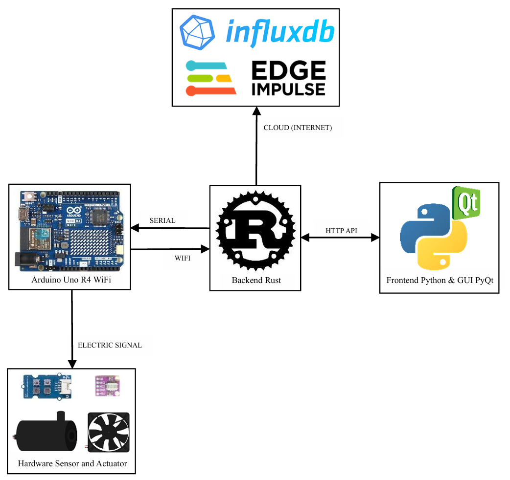

# **SPS Project: Electronic Nose**


Electronic Nose (E-Nose) is a sophisticated IoT system designed to mimic biological olfaction using a multi-sensor array. Unlike passive gas detectors, this project implements an Active Sampling Chamber mechanism that controls airflow dynamics to ensure optimal testing conditions.

By integrating high-precision sensors (Grove Multichannel V2 & MiCS-5524) with a custom-built pneumatic system (Fans & Pumps), the device executes a strict Finite State Machine (FSM) cycle—including Pre-conditioning, Sampling, and Purging phases. This ensures consistent environmental baselines and reduces noise in gas readings.

The system is powered by a high-performance Rust Backend for low-latency data processing and features a user-friendly Python (PyQt) interface for real-time visualization, cloud logging (InfluxDB), and AI integration (Edge Impulse).

## **👨‍💻 Author**
**1. Evan Javier Firdausi Malik (2042241010)** \
**2. Rahma Aulia (2042241056)** \
**3. M. Farel Alberto Firest (2042241058)** 

**Lecturer: Ahmad Radhy, S.Si., M.Si.**

**Instrumentation Engineering Departement - Institut Teknologi Sepuluh Nopember**

## **📊 Test Results & Resources**

For detailed test results, data analysis, and presentation materials, please refer to the following directories:

* **📄 Full Report (`/report`)**
    [View Report](./report)
    Contains the comprehensive report covering the methodology, data analysis, and final conclusion of the project.

* **📢 Presentation (`/ppt`)**
    [View Slides](./ppt)
    The presentation slides (PowerPoint) used for project demonstration and defense.

* **📂 Documentation (`/documentation`)**
    [View Documentation](./documentation)
    Technical directory containing 3D Designs, Signal Graphs (Gnuplot/Edge Impulse), and other visual assets.

* **Data CSV (`/data_csv`)**
    [View Data](./data_csv)
    Contains raw data sampling from the test, used to make graphs and data analysis.

## **▶️ Video Demo (`youtube`)**
The video contains the explanation about the system project that we build. Click this link to view the system demonstration uploaded to YouTube.

[E-Nose: Electronic Olfactory System with Rust and Python Integration](https://youtu.be/Z2aAtHEtpb0?si=8ufsRznXBt-KbuYh)

## **🏗️ System Architecture**




## **📁 Project Structure**

```text
SPS_PROJECT
├── arduino
│   └── arduino.ino              # Arduino code
├── backend                      # Backend with Rust
│   ├── src
│   │   └── main.rs              # Rust Main program and logic
│   ├── target
│   ├── .gitignore
│   ├── Cargo.lock
│   └── Cargo.toml               # Dependencies Rust
├── data_csv                     # Exported CSV data storage
├── documentation                # Documentation Assets
│   ├── 3d_design                # Hardware 3D Design
│   ├── graph
│   │   ├── edge_impulse         # Edge Impulse graph documentation
│   │   └── gnuplot              # GNUPLOT graph documentation
│   ├── gui                      # GUI documentation
│   ├── images                   # Sampling and other images documentation
│   └── videos                   # Video documentation
├── frontend                     # Frontend with Python (PyQt)
│   ├── __pycache__
│   ├── main.py                  # Python Main program and logic
│   ├── project_gui.py           # Generated from Qt Designer
│   └── project_gui.ui           # Generated from Qt Designer
├── ppt                          # Presentation folder
├── report                       # Report project
├── venv                         # Virtual environment Python
├── youtube                      # Youtube video
└── README.md
```

## **🏗 System Communication**

This project utilizes a modular architecture integrating embedded hardware, a high-performance Rust backend, and a Python-based GUI. The system communication flow is illustrated below:

### **Communication Protocol Breakdown**

The system relies on several communication protocols to bridge hardware, software, and cloud services:

1.  **Hardware Layer (Edge)**
    * **Sensors & Actuators ↔ Arduino Uno R4 WiFi:**
        The physical sensors and actuators interact with the microcontroller via **electric signal**.
    * **Arduino ↔ Backend (Rust):**
        The Arduino transmits telemetry data and receives control commands from the Backend using two primary channels:
        * **Serial (USB):** For low-latency, tethered communication.
        * **WiFi:** For wireless data transmission within the local network.

2.  **Core Logic (Backend)**
    * **Backend (Rust):**
        Acts as the central orchestrator. It parses incoming data from the Arduino, handles business logic, and routes data to external services.

3.  **Presentation Layer (Frontend)**
    * **Frontend (Python/PyQt) ↔ Backend:**
        The GUI communicates with the Rust backend via a **HTTP API**. This allows the user interface to request status updates and send commands without being tightly coupled to the core logic.

4.  **Cloud & Intelligence**
    * **Backend ↔ Cloud Services:**
        The Rust backend connects to the internet to integrate with third-party services:
        * **InfluxDB:** Used for storing time-series data (historical sensor logs).
        * **Edge Impulse:** Used for Machine Learning inference and signal processing (AI/ML).

## **🦀 Rust Backend Logic (`main.rs`)**

The backend is built using **Rust** to ensure high performance and memory safety. It utilizes the **Tokio** asynchronous runtime and **Axum** web framework to handle multiple concurrent connections without blocking.

**Key Responsibilities:**
1.  **Orchestration:** Manages the connection between the Hardware (Arduino) and the Frontend (Python).
2.  **Concurrency:** Runs a TCP server (for WiFi data) and an HTTP server (for GUI API) simultaneously.
3.  **State Management:** Holds real-time sensor data and historical logs in thread-safe memory (`Arc<Mutex>`).

### **Code Breakdown**

Below are the primary functions that drive the system logic:

#### **1. Dual-Server Setup (`main`)**
The entry point initializes the shared application state and spawns two asynchronous tasks: one for the **TCP Listener** (receiving raw sensor data) and one for the **HTTP API** (serving the GUI).

```rust
#[tokio::main]
async fn main() {
    // Shared State Initialization (Thread-safe)
    let state = AppState {
        latest_data: Arc::new(Mutex::new(vec![])),
        history: Arc::new(Mutex::new(vec![])),
        serial_tx: Arc::new(AsyncMutex::new(None)),
    };

    // 1. Spawn TCP Server for Arduino WiFi Data (Port 8081)
    let state_clone_for_tcp = state.clone();
    task::spawn(async move {
        start_data_server(state_clone_for_tcp).await;
    });

    // 2. Start HTTP Server for Python GUI (Port 8000)
    let app = Router::new()
        // ... routes definition ...
        .with_state(state);

    let listener = tokio::net::TcpListener::bind("0.0.0.0:8000").await.unwrap();
    axum::serve(listener, app).await.unwrap();
}
```

#### **2. Handling Incoming Sensor Data (`start_data_server`)**
This function listens on **Port 8081**. When the Arduino sends data via WiFi, this function reads the stream line-by-line, parses the CSV format, and updates the shared memory.

```rust
async fn start_data_server(state: AppState) {
    let listener = TcpListener::bind("0.0.0.0:8081").await.unwrap();
    
    // Accept incoming WiFi connections
    while let Ok((socket, _)) = listener.accept().await {
        task::spawn(async move {
            let mut reader = BufReader::new(socket);
            // ... reading loop ...
            // Parse CSV: "val1,val2,..." -> Vec<f64>
            let values: Vec<f64> = line.trim().split(',')
                .filter_map(|v| v.parse().ok())
                .collect();

            // Update Global State
            if values.len() >= 7 {
                *latest_data.lock().unwrap() = values.clone(); // For Live Graph
                history.lock().unwrap().push(values);          // For Export/Logs
            }
        });
    }
}
```

### **3. Serial Communication Control**
The backend allows the Python GUI to control the hardware physically via **USB Serial**. It uses `tokio-serial` to send commands like `START` or `STOP` without blocking the main thread.

```rust
async fn send_start_command(State(state): State<AppState>) -> Json<&'static str> {
    // Lock the serial port mutex
    let mut guard = state.serial_tx.lock().await;
    
    if let Some(port) = guard.as_mut() {
        // Send bytes to Arduino
        let _ = port.write_all(b"START_SAMPLING\n").await;
        Json("Sent")
    } else {
        Json("No Serial Connection")
    }
}
```

### **4. API for Frontend Visualization**
The Python GUI requests data every few milliseconds. This endpoint locks the shared memory, retrieves the latest sensor reading, and returns it as JSON.

```rust
// GET /data
async fn get_data(State(state): State<AppState>) -> Json<SensorData> {
    let data = state.latest_data.lock().unwrap().clone();
    Json(SensorData { values: data })
}
```

## **🐍 Frontend Python Logic (`main.py`)**

The Frontend is built using **Python** with the **PyQt6** framework for the desktop interface and **PyQtGraph** for high-performance real-time plotting. This application acts as the "Control Center" for the user.

**Key Responsibilities:**
1.  **Visualization:** Renders real-time sensor signal graphs.
2.  **System Control:** Sends commands (Start/Stop/Connect) to the Rust Backend via HTTP Requests.
3.  **Cloud Sync:** Automatically uploads sensor data to **InfluxDB** (Database) and **Edge Impulse** (AI Training).
4.  **Data Export:** Retrieves the full acquisition history and saves it as CSV or JSON.

### **Code Breakdown**

Below are the primary functions in `main.py` that drive the application logic:

#### **1. Initialization & Timer (`__init__`)**
The application avoids using a blocking `while True` loop to keep the GUI responsive. Instead, it utilizes a `QTimer` that triggers the data fetching function every 250 milliseconds.

```python
def __init__(self):
    # Setup UI & Database Connection
    self.influx_client = InfluxDBClient(url=INFLUX_URL, ...)
    
    # Setup Polling Timer
    self.timer = QTimer()
    self.timer.timeout.connect(self.fetch_data) # Calls fetch_data() every tick
```

#### **2. The Data Loop (`fetch_data`)**
This is the core function running during sampling. Its workflow is:
1. **GET Request:** Polls the latest data from the Rust Backend (`http://127.0.0.1:8000/data`).
2. **Update Buffer:** Appends data to local memory for the graph.
3. **Update Graph:** Redraws the curves using `PyQtGraph`.
4. **Cloud Upload:** Sends the data point to InfluxDB for remote monitoring.

```python
def fetch_data(self):
    try:
        # 1. Fetch data from Rust Backend
        response = requests.get(f"{BACKEND_URL}/data")
        values = response.json().get("values", [])

        # 2. Update Real-time Graph
        if len(values) >= self.num_sensors:
            self.ui.plotWidget.plot(self.time_buffer, self.data_buffer[i], ...)

        # 3. Send to Cloud (InfluxDB)
        if self.write_api:
            p = Point("SensorData").tag("sample", self.current_sample_name)
            self.write_api.write(bucket=INFLUX_BUCKET, record=p)
    except:
        pass
```

#### **3. Backend Control**
The Frontend does not communicate directly with the Arduino. It instructs the Rust Backend to open/close the serial connection.

```python
def connect_backend(self):
    # Send selected port (e.g., COM3) to Rust
    requests.post(f"{BACKEND_URL}/connect", json={"port": selected_port})

def start_sampling(self):
    # Instruct Rust to send 'START' command to Arduino
    requests.post(f"{BACKEND_URL}/start_sampling")
    self.timer.start(250) # Start graph updates
```

#### **4. Data Export (`export_csv` & `export_edge_impulse`)**
When the user saves data, Python does not use its local graph buffer (which might be truncated). Instead, it requests the full data history from the Rust Backend (`/history`) to ensure data integrity before saving to a file or uploading to the AI platform.

```python
def export_csv(self):
    # Fetch full history from Rust RAM
    history_data = self.get_backend_history() 
    
    # Write to local CSV file
    with open(file_path, 'w') as f:
        w = csv.writer(f)
        w.writerow(["timestamp"] + self.sensor_names)
        # ... writing rows ...
```

## **🔌 Arduino Logic (Embedded Firmware)**

The firmware running on the **Arduino Uno R4 WiFi** is responsible for the physical layer of the system. It handles sensor data acquisition, actuator control (pumps/fans), and network communication.

**Key Responsibilities:**
1.  **Data Acquisition:** Reads 7 gas parameters from the Grove Multichannel Gas Sensor (I2C) and MiCS-5524 (Analog).
2.  **Actuator Control:** Manages the air flow using a Pump and Fan via PWM.
3.  **Automated Sampling (FSM):** Executes a strict timing cycle (Pre-condition → Sampling → Purging) for consistent data collection.
4.  **Telemetry:** Streams processed data to the Rust Backend via WiFi (TCP).

### **Code Breakdown**

The logic is structured around a **Finite State Machine (FSM)** to ensure the gas sensors are exposed to the sample and fresh air in a controlled manner.

#### **1. The Sampling Cycle (FSM)**
The `runFSM()` function manages the testing lifecycle. It cycles through 5 different speed levels (`speeds[]`) to test the sensor response under varying flow conditions.

| State | Description | Duration | Actuator Behavior |
| :--- | :--- | :--- | :--- |
| **PRE_COND** | Chamber preparation | 5s | Fan ON (Medium), Pump OFF |
| **RAMP_UP** | Stabilizing flow | 3s | Fan ramps to target speed |
| **HOLD** | **Sampling Phase** | 20s | Fan stable at target speed |
| **PURGE** | Cleaning chamber | 40s | Fan & Pump **Reverse** (Exhaust) |
| **RECOVERY** | Sensor recovery | 5s | All OFF |

*After `RECOVERY`, the system increments the Speed Level and repeats the cycle until all 5 levels are complete.*

#### **2. Signal Processing (`calculateRs` & `ppmFromRatio`)**
The code converts raw analog voltage from the MiCS-5524 sensor into meaningful PPM (Parts Per Million) values using logarithmic gas curves.
* **Voltage to Resistance:** $R_s = R_{load} \times (\frac{V_{cc} - V_{out}}{V_{out}})$
* **Ratio to PPM:** Uses the calculated $R_s/R_0$ ratio to determine gas concentration based on specific sensitivity slopes for CO, Ethanol, and VOC.

#### **3. Dual Communication Architecture**
The Arduino uses two separate channels for communication:

* **Command Channel (Serial/USB):**
    Listens for control strings `START_SAMPLING` or `STOP_SAMPLING` sent by the Rust Backend (triggered by the Python GUI).
    
    ```cpp
    if (Serial.available()) {
      String cmd = Serial.readStringUntil('\n');
      if (cmd == "START_SAMPLING") startSampling();
    }
    ```

* **Data Channel (WiFi/TCP):**
    Connects as a TCP Client to the Rust Server (`10.60.145.140:8081`). Every **250ms**, it formats sensor readings into a CSV string and pushes it over the network.

    ```cpp
    // Format: NO2, Eth, VOC, CO, CO_mics, Eth_mics, VOC_mics, State, Level
    client.println(data); 
    ```

## **⚙️ Prerequisites & Setup**

Before running the project, ensure you have the following installed:

### **Software**
* **Rust & Cargo:** [Install Rust](https://www.rust-lang.org/tools/install)
* **Python 3.8+:** [Install Python](https://www.python.org/downloads/)
* **Arduino IDE:** [Install Arduino IDE](https://www.arduino.cc/en/software/), don't forget to install the **Arduino UNO R4 Boards** package too.

### **Dependencies**
**1. Python (Frontend)**
Install the required libraries via pip:
```bash
pip install PyQt6 pyqtgraph requests pyserial edgeimpulse-api influxdb-client
```

**2. Rust (Backend)**
The `Cargo.toml` will handle dependencies automatically, but ensure you have these crates:
* **`axum`, `tokio`, `tokio-serial`, `serde`, `serde_json`**

**3. Arduino Libraries**
Install these via the Arduino Library Manager:
* **`Grove - Multichannel Gas Sensor V2`** (Seeed Studio)
* **`WiFiS3`** (Built-in for Uno R4)

### **Hardware Pinout (Wiring)**
Since this is a project that used microcontroller, a wiring table is **crucial**. Without it, the code is useless because nobody knows where to plug in the sensors. Based on the Arduino code (`#define`), connect the sensors and actuators to the Arduino Uno R4 WiFi as follows, here is the table:

| Component          | Arduino Pin   | Description                             |
| :---               | :---          | :---                                    |
| **MiCS-5524** | A1            | Analog Gas Output                       |
| **Grove Gas V2** | I2C (SDA/SCL) | Multichannel Sensor (NO2, Eth, VOC, CO) |
| **Fan (PWM)** | D6            | PWM Speed Control                       |
| **Fan (Dir 1)** | D9            | Direction Pin A                         |
| **Fan (Dir 2)** | D10           | Direction Pin B                         |
| **Pump (PWM)** | D5            | PWM Speed Control                       |
| **Pump (Dir 1)** | D7            | Direction Pin A                         |
| **Pump (Dir 2)** | D8            | Direction Pin B                         |

### **📦 Hardware Bill of Materials**

* **Microcontroller:** Arduino Uno R4 WiFi
* **Gas Sensor 1:** Grove - Multichannel Gas Sensor V2 (I2C)
* **Gas Sensor 2:** MiCS-5524 MEMS Gas Sensor (Analog)
* **Actuators:** 5V DC Mini Pump & 5V DC Fan
* **Driver:** L298N or generic Motor Driver Module

## **🚀 How to Run**

Follow these steps to initialize the system components in the correct order.

### **1. Start the Backend (Rust)**
The backend must be running first so the Arduino has a server to connect to.

1.  Open a terminal and navigate to the `backend` directory.
2.  Run the server:
    ```bash
    cd backend
    cargo run
    ```
3.  **Verify:** You should see `"BACKEND RUNNING"` and the server listening on Port `8081` (WiFi) and `8000` (API).

### **2. Upload Firmware (Arduino)**
1.  Open `arduino/arduino.ino` in the Arduino IDE.
2.  **Crucial Configuration:**
    * Modify `const char* ssid` and `pass` with your WiFi credentials.
    * Modify `const char* RUST_IP` with your computer's local IP address (e.g., `192.168.1.X`).
3.  Connect the **Arduino Uno R4 WiFi** to your PC via USB.
4.  Click **Upload**.
5.  *Note: The Arduino will automatically try to connect to the WiFi and the Rust server once powered on.*

### **3. Start the Frontend (Python)**
1.  Open a new terminal and navigate to the `frontend` directory.
2.  Run the interface:
    ```bash
    cd frontend
    python main.py
    ```
3.  The GUI window should appear on your screen.

### **4. 🎮 User Guide (GUI Controls)**
Once the system is running, follow this workflow to collect data:

#### **A. Connection**
1.  **Select Port:** In the dropdown menu, select the USB port connected to the Arduino (e.g., `COM3` or `/dev/ttyUSB0`).
2.  Click **`Connect`**.
    * *Status will change to "Connected ✅".*

#### **B. Data Acquisition**
1.  **Sample Name:** Enter a unique name for the sample in the text box (e.g., `Coffee_Sample_01`).
2.  **Start Sampling:**
    * Click **`Start`**.
    * The Arduino will begin the FSM cycle (Fan/Pump sequence).
    * The graph will immediately start plotting real-time data from 7 sensors.
3.  **Stop Sampling:**
    * Click **`Stop`** to halt the recording and the graph updates.
    * *Note: This stops the data stream but keeps the data in memory.*
4.  **Reset:**
    * Click **`Reset`** to clear the current graph and empty the data buffer in the Backend.
    * *Use this before starting a completely new test subject.*

#### **C. Visualization Controls**
* **Checkbox Signal Availability:**
    * On the right panel, uncheck boxes (e.g., `NO2`, `CO`) to **hide** specific lines on the graph.
    * Check them to **show** the data again. This helps in analyzing specific sensors without visual clutter.

#### **D. Exporting Data**
After stopping the sampling, you can save your data:

* **`Export CSV`**: Saves the full session history to a `.csv` file (Excel compatible).
* **`Export JSON`**: Saves the data structure to a `.json` file (Web/App compatible).
* **`Upload Edge Impulse`**: Automatically uploads the CSV data to your Edge Impulse project for Machine Learning training (requires API Key).

### **5. ❓ Troubleshooting**

**1. "Connection Failed" on Arduino Serial Monitor**
* Ensure the `RUST_IP` in `arduino.ino` matches your PC's IP address (check via `ipconfig` or `ifconfig`).
* Ensure the PC and Arduino are on the **same WiFi network**.
* Check if your PC's Firewall is blocking Port **8081**.

**2. Python GUI shows "No Serial Connection"**
* Make sure you clicked the **Connect** button *before* clicking Start.
* Ensure no other software (like Arduino Serial Monitor) is using the COM port simultaneously.

**3. Graph lines are flat (0.00)**
* The sensors require a "Burn-in" period. Let the system run for 5-10 minutes to heat up the sensor plates (Pre-heat).

## **📄 License**
**Develop by:** Group 4 SPS \
**Version:** 1.0 \
**Last Update:** December 2025